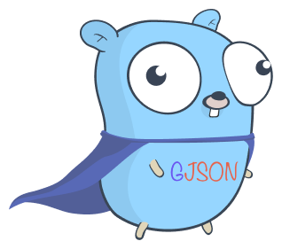

<p align="center">

<br>


	
</p>
<p align="center">
<a href="https://goreportcard.com/report/github.com/crossoverJie/gjson"></a>
<a href="https://codecov.io/gh/crossoverJie/gjson"></a>
<br>
Query and Arithmetic
</p>


`gjson` is a `JSON` parsing library, you can query `JSON` like `OOP`. 

```go
str := `{"people":{"name":{"first":"bob"}}}`
first := gjson.Get(str, "people.name.first")
assert.Equal(t, first.String(), "bob")
```

Even perform arithmetic operations with `JSON`.

```go
str := `{"people":[{"bob":{"age":10}},{"alice":{"age":10}}]}`
age := gjson.GetWithArithmetic(str, "people[0].bob.age + people[1].alice.age")
assert.Equal(t, age.Int(), 20)
```

Installing:

```shell
go get github.com/crossoverJie/gjson
```

# Query Syntax

- Use dot `.` to indicate object nesting relationships.
- Use `[index]` indicate an array.

```go
str := `
{
"name": "bob",
"age": 20,
"skill": {
    "lang": [
        {
            "go": {
                "feature": [
                    "goroutine",
                    "channel",
                    "simple",
                    true
                ]
            }
        }
    ]
}
}`

name := gjson.Get(str, "name")
assert.Equal(t, name.String(), "bob")

age := gjson.Get(str, "age")
assert.Equal(t, age.Int(), 20)

assert.Equal(t, gjson.Get(str,"skill.lang[0].go.feature[0]").String(), "goroutine")
assert.Equal(t, gjson.Get(str,"skill.lang[0].go.feature[1]").String(), "channel")
assert.Equal(t, gjson.Get(str,"skill.lang[0].go.feature[2]").String(), "simple")
assert.Equal(t, gjson.Get(str,"skill.lang[0].go.feature[3]").Bool(), true)
```

The tow syntax work together to obtain complex nested `JSON` data.

# Arithmetic Syntax

`gjson` supports `+ - * / ()` arithmetic operations.

```go
str := `{"name":"bob", "age":10,"magic":10.1, "score":{"math":[1,2]}}`
result := gjson.GetWithArithmetic(str, "(age+age)*age+magic")
assert.Equal(t, result.Float(), 210.1)
result = gjson.GetWithArithmetic(str, "(age+age)*age")
assert.Equal(t, result.Int(), 200)

result = gjson.GetWithArithmetic(str, "(age+age) * age + score.math[0]")
assert.Equal(t, result.Int(), 201)

result = gjson.GetWithArithmetic(str, "(age+age) * age - score.math[0]")
assert.Equal(t, result.Int(), 199)
```

**Attention**:

- Only **int/float** are supported.
- When other types(`string/bool/null..`) exist, the empty `Result` will be returned.
- When `int` and `float` are caculated, **float** will be returned.

# Result

Both `Get()/GetWithArithmetic` will return `Result` type.


It provides the following methods to help us obtain data more easily.

```go
func (r Result) String() string
func (r Result) Bool() bool
func (r Result) Int() int
func (r Result) Float() float64
func (r Result) Map() map[string]interface{}
func (r Result) Array() *[]interface{}
func (r Result) Exists() bool
```

> You can tell what they mean from their names.

# Other APIs

## Decode

It can convert `JSON` strings to `interface{}`.

```go
func TestJson(t *testing.T) {
	str := `{
   "glossary": {
       "title": "example glossary",
		"age":1,
		"long":99.99,
		"GlossDiv": {
           "title": "S",
			"GlossList": {
               "GlossEntry": {
                   "ID": "SGML",
					"SortAs": "SGML",
					"GlossTerm": "Standard Generalized Markup Language",
					"Acronym": "SGML",
					"Abbrev": "ISO 8879:1986",
					"GlossDef": {
                       "para": "A meta-markup language, used to create markup languages such as DocBook.",
						"GlossSeeAlso": ["GML", "XML", true, null]
                   },
					"GlossSee": "markup"
               }
           }
       }
   }
}`
	decode, err := gjson.Decode(str)
	assert.Nil(t, err)
	fmt.Println(decode)
	v := decode.(map[string]interface{})
	glossary := v["glossary"].(map[string]interface{})
	assert.Equal(t, glossary["title"], "example glossary")
	assert.Equal(t, glossary["age"], 1)
	assert.Equal(t, glossary["long"], 99.99)
	glossDiv := glossary["GlossDiv"].(map[string]interface{})
	assert.Equal(t, glossDiv["title"], "S")
	glossList := glossDiv["GlossList"].(map[string]interface{})
	glossEntry := glossList["GlossEntry"].(map[string]interface{})
	assert.Equal(t, glossEntry["ID"], "SGML")
	assert.Equal(t, glossEntry["SortAs"], "SGML")
	assert.Equal(t, glossEntry["GlossTerm"], "Standard Generalized Markup Language")
	assert.Equal(t, glossEntry["Acronym"], "SGML")
	assert.Equal(t, glossEntry["Abbrev"], "ISO 8879:1986")
	glossDef := glossEntry["GlossDef"].(map[string]interface{})
	assert.Equal(t, glossDef["para"], "A meta-markup language, used to create markup languages such as DocBook.")
	glossSeeAlso := glossDef["GlossSeeAlso"].(*[]interface{})
	assert.Equal(t, (*glossSeeAlso)[0], "GML")
	assert.Equal(t, (*glossSeeAlso)[1], "XML")
	assert.Equal(t, (*glossSeeAlso)[2], true)
	assert.Equal(t, (*glossSeeAlso)[3], "")
	assert.Equal(t, glossEntry["GlossSee"], "markup")
}
```

# Features
- [x] Support syntax: `gjson.Get("glossary.title")`
- [x] Support arithmetic operators: `gjson.Get("glossary.age+long")`
- [ ] Resolve to struct

# Acknowledgements

[gjson](https://github.com/tidwall/gjson)

[gscript](https://github.com/crossoverjie/gscript)
